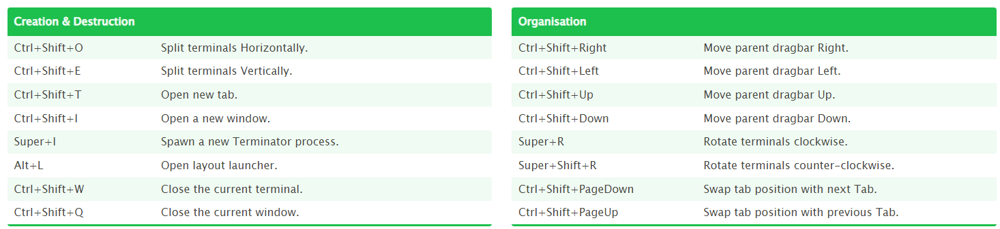

# ROS2 For Beginners

## Install ROS2 and Setup Your Environment:
I assume you have a virtual machine with Linux distribution on it (like Ubuntu).
``` bash
𝑠𝑢𝑑𝑜 𝑎𝑝𝑡 𝑢𝑝𝑑𝑎𝑡𝑒
𝑠𝑢𝑑𝑜 𝑎𝑝𝑡 𝑢𝑝𝑔𝑟𝑎𝑑𝑒
𝑠𝑢𝑑𝑜 𝑎𝑝𝑡 𝑎𝑢𝑡𝑜𝑟𝑒𝑚𝑜𝑣𝑒
``` 

to make sure your system is up to date.

### Terminator
``` bash
𝑠𝑢𝑑𝑜 𝑎𝑝𝑡 𝑖𝑛𝑠𝑡𝑎𝑙𝑙 𝑡𝑒𝑟𝑚𝑖𝑛𝑎𝑡𝑜𝑟
```



### VS-code:
Add three main extensions – C/C++, CMake, Python.
Make sure you have python installed:
```bash 
𝑠𝑢𝑑𝑜 𝑎𝑝𝑡 𝑖𝑛𝑠𝑡𝑎𝑙𝑙 𝑝𝑦𝑡ℎ𝑜𝑛3−𝑝𝑖𝑝
```

NEW COMMAND: `𝑔𝑒𝑑𝑖𝑡` – opens files in a more comfortable user interface.

For example: `𝑔𝑒𝑑𝑖𝑡 ~/.𝑏𝑎𝑠ℎ𝑟𝑐`.

### ROS2:
As of this writing the most current distribution of ROS2 is Humble Hawksbill.

Enter ROS2 Documentation: Humble and choose Ubuntu (Debian). Follow the steps there including Setup locale, Setup Sources, Install ROS2 packages. Then, run the desktop installation command line to have all the ROS2 tools.

By the end of the previous part, you should have `/𝑜𝑝𝑡/𝑟𝑜𝑠/ℎ𝑢𝑚𝑏𝑙𝑒` directory.

In order to use ROS2 you need to run: 𝑠𝑜𝑢𝑟𝑐𝑒 `/𝑜𝑝𝑡/𝑟𝑜𝑠/ℎ𝑢𝑚𝑏𝑙𝑒/𝑠𝑒𝑡𝑢𝑝.𝑏𝑎𝑠ℎ`. To avoid running this command again in any new terminal, add this command into `~/.𝑏𝑎𝑠ℎ𝑟𝑐`.

``` bash title="NEW COMMAND"
𝑟𝑜𝑠2 𝑟𝑢𝑛 <𝑃𝐴𝐶𝐾𝐴𝐺𝐸_𝑁𝐴𝑀𝐸> <𝐸𝑋𝐸𝐶𝑈𝑇𝐴𝐵𝐿𝐸>
```


Check the `𝑑𝑒𝑚𝑜_𝑛𝑜𝑑𝑒𝑠_𝑐𝑝𝑝` package for practice (talker, listener etc.).

## Write Your First ROS2 Program:

### Colcon:
A build tool created for ROS2.

``` bash
𝑠𝑢𝑑𝑜 𝑎𝑝𝑡 𝑖𝑛𝑠𝑡𝑎𝑙𝑙 p𝑦𝑡ℎ𝑜𝑛3−𝑐𝑜𝑙𝑐𝑜𝑛−𝑐𝑜𝑚𝑚𝑜𝑛−𝑒𝑥𝑡𝑒𝑛𝑠𝑖𝑜𝑛𝑠
```

Auto completion feature is not enabled as default. To enable this feature, you will need to run:

``` bash
source /usr/share/colcon_argcomplete/hook/colcon−argcomplete.bash
```

Also here, it recommended to add this command into `~/.𝑏𝑎𝑠ℎ𝑟𝑐`.

### ROS2 Workspace:

First, create a new folder: `𝑚𝑘𝑑𝑖𝑟 ~/𝑟𝑜𝑠2_𝑤𝑠`. Second, create source code folder: `𝑚𝑘𝑑𝑖𝑟 ~/𝑟𝑜𝑠2_𝑤𝑠/𝑠𝑟𝑐`. Stay at the 𝑟𝑜𝑠2_𝑤𝑠 folder and run:

NEW COMMAND: `𝑐𝑜𝑙𝑐𝑜𝑛 𝑏𝑢𝑖𝑙𝑑` - this command creates the install, log and build folders inside 𝑟𝑜𝑠2_𝑤𝑠 (the workspace folder). We will use some additional parts in this command when we will compile a package (look down at this page).

In install folder, there is a 𝑠𝑒𝑡𝑢𝑝.𝑏𝑎𝑠ℎ file needs to be sourced. In case you will use this workspace often, it is recommended to add 𝑠𝑜𝑢𝑟𝑐𝑒 `~/𝑟𝑜𝑠2_𝑤𝑠/𝑖𝑛𝑠𝑡𝑎𝑙𝑙/𝑠𝑒𝑡𝑢𝑝.𝑏𝑎𝑠ℎ` into the `~/.𝑏𝑎𝑠ℎ𝑟𝑐` file too.


### ROS2 Package:

The code in workspace will be organized in packages. All packages will be in the `~/𝑟𝑜𝑠2_𝑤𝑠/𝑠𝑟𝑐` folder. To create a new one, stand at this location and run:

```bash title="NEW COMMAND"
𝑟𝑜𝑠2 𝑝𝑘𝑔 𝑐𝑟𝑒𝑎𝑡𝑒<𝑃𝐴𝐶𝐾𝐴𝐺𝐸_𝑁𝐴𝑀𝐸>
```


Usually we will use this command with 2 additional parts:

`−−𝑏𝑢𝑖𝑙𝑑−𝑡𝑦𝑝𝑒 <𝐵𝑈𝐼𝐿𝐷_𝑇𝑌𝑃𝐸>`: telling whether we want a python or cpp package. Enter here 𝑎𝑚𝑒𝑛𝑡_𝑝𝑦𝑡ℎ𝑜𝑛 or 𝑎𝑚𝑒𝑛𝑡_𝑐𝑚𝑎𝑘𝑒.

`−−𝑑𝑒𝑝𝑒𝑛𝑑𝑒𝑛𝑐𝑖𝑒𝑠 <𝐷𝐸𝑃𝐸𝑁𝐷𝐸𝑁𝐶𝐼𝐸𝑆_𝐿𝐼𝑆𝑇>`: other packages we will use in ours.

A new package comes with a folder in it which has the same name as the package itself. There we will write our ROS2 nodes in the future. The package also comes with a 
`𝑝𝑎𝑐𝑘𝑎𝑔𝑒.𝑥𝑚𝑙` file. This file contains some global details, the package dependencies and build type.

### Compile ROS2 package:
After writing some code, before running it, we need to build the package by standing at `~/𝑟𝑜𝑠2_𝑤𝑠` (the workspace folder) and run:

``` bash title="COMMAND"
𝑐𝑜𝑙𝑐𝑜𝑛 𝑏𝑢𝑖𝑙𝑑
```

To build only specific packages you can use: `−−𝑝𝑎𝑐𝑘𝑎𝑔𝑒𝑠_𝑠𝑒𝑙𝑒𝑐𝑡<𝑃𝐴𝐶𝐾𝐴𝐺𝐸𝑆_𝐿𝐼𝑆𝑇>`

To automatically build the package use:
You might see a 𝑆𝑒𝑡𝑢𝑝𝑡𝑜𝑜𝑙𝑠𝐷𝑒𝑝𝑟𝑒𝑐𝑎𝑡𝑖𝑜𝑛𝑊𝑎𝑟𝑛𝑖𝑛𝑔. The reason of that is the version of 𝑠𝑒𝑡𝑢𝑝𝑡𝑜𝑜𝑙𝑠 as you can see by running: `𝑝𝑖𝑝3 𝑙𝑖𝑠𝑡 | 𝑔𝑟𝑒𝑝 𝑠𝑒𝑡𝑢𝑝𝑡𝑜𝑜𝑙𝑠`.

To fix that run: `𝑝𝑖𝑝3 𝑖𝑛𝑠𝑡𝑎𝑙𝑙 𝑠𝑒𝑡𝑢𝑝𝑡𝑜𝑜𝑙𝑠==58.2.0` to downgrade `𝑠𝑒𝑡𝑢𝑝𝑡𝑜𝑜𝑙𝑠`.

### Running ROS2 Node:

A node is a python file. We will write our first nodes according to fixed template I will show later in Writing ROS2 Node section. To run a ROS2 node we can make the file to be executable (using `𝑐ℎ𝑚𝑜𝑑` command) and just run it like:

`𝑝𝑦𝑡ℎ𝑜𝑛3<𝑃𝑌𝑇𝐻𝑂𝑁_𝑁𝑂𝐷𝐸_𝐹𝐼𝐿𝐸_𝑁𝐴𝑀𝐸>`


Good to Know: When you are writing python file, you can use 𝑠ℎ𝑎𝑏𝑎𝑛𝑔 in the first code line. It is a line starts with #! that sets the interpreter which will run the code. Usually will be:

`#!/𝑢𝑠𝑟/𝑏𝑖𝑛/𝑒𝑛𝑣 𝑝𝑦𝑡ℎ𝑜𝑛3`

That way we will run a node like:

`./<𝑃𝑌𝑇𝐻𝑂𝑁_𝑁𝑂𝐷𝐸_𝐹𝐼𝐿𝐸>`


### Install ROS2 Node into Workspace:

we don’t want to run nodes like above because it is not scalable. Instead, we will install the nodes. We do so using the `𝑠𝑒𝑡𝑢𝑝.𝑝𝑦`. In this file there is a python dictionary named `𝑒𝑛𝑡𝑟𝑦_𝑝𝑜𝑖𝑛𝑡𝑠`.

In this dictionary, there is a `𝑐𝑜𝑛𝑠𝑜𝑙𝑒_𝑠𝑐𝑟𝑖𝑝𝑡𝑠` key which contains an array. This array is the place where we are telling ROS2 which nodes it should know.

When we will build the package later, ROS2 will take the python filles we put there and make executables from them. The location where these executables we be stored in is written in the `𝑠𝑒𝑡𝑢𝑝.𝑐𝑓𝑔` file.

If any error occurs you might need to run: `𝑠𝑜𝑢𝑟𝑐𝑒 ~/.𝑏𝑎𝑠ℎ𝑟𝑐` to sure you have the latest version of your package.


### ROS2 run tool:

Usually we will not run our nodes as described in `Running ROS2 Node` section. The way we will do so is by:

COMMAND: `𝑟𝑜𝑠2 𝑟𝑢𝑛 <𝑃𝐴𝐶𝐾𝐴𝐺𝐸_𝑁𝐴𝑀𝐸> <𝐸𝑋𝐸𝐶𝑈𝑇𝐴𝐵𝐿𝐸>`.

linenums="1"

``` python title="bubble_sort.py"
def bubble_sort(items):
    for i in range(len(items)):
        for j in range(len(items) - 1 - i):
            if items[j] > items[j + 1]:
                items[j], items[j + 1] = items[j + 1], items[j]
```